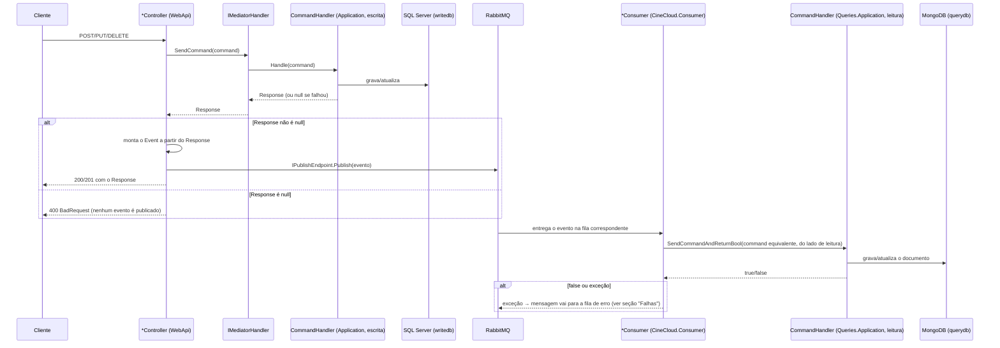

# Barramento de eventos (RabbitMQ) — como funciona na prática

Este documento explica, passo a passo e com nomes de classe/arquivo reais, como uma
escrita na API (`CineCloud.WebApi`) termina virando um documento atualizado no MongoDB,
passando pelo RabbitMQ e pelo `CineCloud.Consumer`. Para uma visão mais geral da
arquitetura veja o [README](../../README.md#arquitetura); para o que cada aba do painel do
RabbitMQ mostra, veja o [README](../../README.md#rabbitmq--painel-de-gerenciamento).

## O princípio geral

Nenhum controller conversa diretamente com o RabbitMQ nem com o MongoDB. O fluxo é sempre:



Ou seja: **o evento só é publicado se a escrita no SQL Server deu certo**, e **o
`CineCloud.Consumer` é o único responsável por escrever no MongoDB** — a API nunca escreve
lá diretamente (nem mesmo a consulta de leitura no `GetDirector`/`GetDvd`, que só faz
`SELECT`).

Cada tipo de evento tem uma **fila fixa** (constantes em
[`EventBusConstants`](../src/BuildingBlocks/BuildingBlocks.Core/EventBus/EventBusConstants.cs))
e **um único consumer** dedicado a ela, configurado em
[`ConsumerConfig.AddConsumerConfig`](../src/Services/Consumer/CineCloud.Consumer/Setup/ConsumerConfig.cs).

## Exemplo completo: criar um Diretor

1. **Cliente chama** `POST /api/v1/Directors/create-director` com `{ "name": "Steven", "surname": "Spielberg" }`.
2. [`DirectorsController.CreateDirector`](../src/Services/Publisher/Presentation/CineCloud.WebApi/Controllers/DirectorsController.cs)
   recebe o `CreateDirectorCommand` e chama `_mediator.SendCommand(command, ...)`.
3. Isso vai parar em
   [`CreateDirectorCommandHandler.Handle`](../src/Services/Publisher/Application/CineCloud.Application/Features/Directors/Commands/CreateDirector/CreateDirectorCommandHandler.cs):
   valida o comando, cria a entidade `Director` (que gera um novo `Guid` como `Id`), grava
   no SQL Server via `IDirectorsWriteRepository.Create` e devolve um `CreateDirectorResponse`.
4. **De volta no controller** — só se `response` não for `null` — é aqui que o evento nasce:
   ```csharp
   var @event = new DirectorCreatedEvent(response.Id, response.FullName, response.CreatedAt, response.UpdatedAt);
   await _publishEndpoint.Publish(@event);
   ```
   Repare que o evento é montado **a partir da resposta do banco de escrita**, não do que o
   cliente enviou — por isso ele carrega o `Id` de verdade que o SQL Server acabou de gerar.
5. **O `Publish` manda o evento pro RabbitMQ.** O MassTransit cria (ou reusa) um *exchange*
   do tipo `fanout` nomeado pelo tipo completo da mensagem
   (`BuildingBlocks.Core.EventBus.Events:DirectorCreatedEvent`) e publica ali. Quem decide
   para qual *fila* isso vai é o **binding** configurado do lado do consumidor (próximo
   passo) — o publisher (a API) nem sabe que fila existe, só publica o evento.
6. **O `CineCloud.Consumer`**, que já está rodando e conectado ao RabbitMQ desde que subiu
   (veja [`ConsumerConfig`](../src/Services/Consumer/CineCloud.Consumer/Setup/ConsumerConfig.cs)),
   tinha configurado antecipadamente:
   ```csharp
   cfg.ReceiveEndpoint(EventBusConstants.CREATE_DIRECTOR_QUEUE, c =>
   {
       c.ConfigureConsumer<DirectorCreatedConsumer>(ctx);
   });
   ```
   Isso faz o RabbitMQ criar a fila `create-director-queue` e vinculá-la (*bind*) ao exchange
   do `DirectorCreatedEvent` — é esse bind, feito na subida do Consumer, que faz a mensagem
   cair nessa fila específica.
7. **[`DirectorCreatedConsumer.Consume`](../src/Services/Consumer/CineCloud.Consumer/Consumers/Directors/DirectorCreatedConsumer.cs)**
   é acionado pelo MassTransit assim que a mensagem chega na fila. Ele:
   - lê `context.Message` (o `DirectorCreatedEvent`);
   - monta o **command equivalente do lado de leitura**,
     `CineCloud.Queries.Application.Features.Directors.Commands.CreateDirector.CreateDirectorCommand`
     (um tipo diferente do command usado no passo 2 — mesmo nome, namespace diferente);
   - chama `_mediator.SendCommandAndReturnBool(command, default)`.
8. Isso cai em
   [`CreateDirectorCommandHandler.Handle`](../src/Shared/Queries/Application/CineCloud.Queries.Application/Features/Directors/Commands/CreateDirector/CreateDirectorCommandHandler.cs)
   **do lado de leitura**: valida, verifica se o diretor já existe no Mongo (idempotência —
   evita duplicar se a mensagem for entregue duas vezes) e grava o documento via
   `IDirectorsQueryRepository.Create`.
9. Se tudo deu certo, o `Director` já existe tanto no SQL Server quanto no MongoDB, e uma
   chamada a `GET /api/v1/Directors/GetDirector/Steven%20Spielberg` já encontra ele (e passa
   a alimentar o cache, no caso de DVDs).

`UpdateDirector` e `DeleteDirector` seguem exatamente o mesmo caminho, só trocando o evento
(`DirectorUpdatedEvent`/`DirectorDeletedEvent`), a fila (`update-director-queue`/
`delete-director-queue`) e o consumer (`DirectorUpdatedConsumer`/`DirectorDeletedConsumer`).

## Exemplo completo: criar um Dvd

O fluxo é idêntico ao do Diretor, só que com mais um cache no meio na hora de consultar.
Ponto a ponto:

1. `POST /api/v1/Dvds/create-dvd` chega em
   [`DvdsController.CreateDvd`](../src/Services/Publisher/Presentation/CineCloud.WebApi/Controllers/DvdsController.cs).
2. O command vai para
   [`CreateDvdCommandHandler`](../src/Services/Publisher/Application/CineCloud.Application/Features/Dvds/Commands/CreateDvd/CreateDvdCommandHandler.cs)
   (lado de escrita), que valida, cria a entidade `Dvd` (o construtor já valida gênero,
   data de publicação, cópias e `DirectorId`) e grava no SQL Server.
3. Com o `CreateDvdResponse` em mãos, o controller monta:
   ```csharp
   var @event = new DvdCreatedEvent(
       response.Id, response.Title, response.Genre, response.Published,
       response.Available, response.Copies, response.DirectorId,
       response.CreatedAt, response.UpdatedAt);
   await _publishEndPoint.Publish(@event);
   ```
4. O `CineCloud.Consumer` recebe na fila `create-dvd-queue`, processado por
   [`DvdCreatedConsumer`](../src/Services/Consumer/CineCloud.Consumer/Consumers/Dvds/DvdCreatedConsumer.cs),
   que valida o comando do lado de leitura e grava o documento no MongoDB via
   `IDvdsQueryRepository.Create`.
5. A partir daí, `GET /api/v1/Dvds/GetDvd/{title}` já encontra o DVD: primeiro tenta o
   **Redis** (`ICacheRepository.Get`); se não achar, busca no MongoDB e **grava no Redis**
   antes de responder (`ICacheRepository.Update`) — só a *consulta* usa cache, a escrita
   nunca passa por ele.

`UpdateDvd`, `RentDvd`, `ReturnDvd` e `DeleteDvd` seguem o mesmo caminho, cada um com seu
próprio evento/fila/consumer — inclusive `RentDvd`/`ReturnDvd`, que não recebem um `command`
completo do cliente (só o `id` na rota): o controller monta o `RentDvdCommand`/
`ReturnDvdCommand` internamente antes de mandar pro mediator.

## Tabela — evento, fila e quem processa

| Ação | Controller | Evento publicado | Fila (RabbitMQ) | Consumer | Command no lado de leitura |
|---|---|---|---|---|---|
| Criar diretor | `DirectorsController.CreateDirector` | `DirectorCreatedEvent` | `create-director-queue` | `DirectorCreatedConsumer` | `CreateDirectorCommand` |
| Atualizar diretor | `DirectorsController.UpdateDirector` | `DirectorUpdatedEvent` | `update-director-queue` | `DirectorUpdatedConsumer` | `UpdateDirectorCommand` |
| Excluir diretor | `DirectorsController.DeleteDirector` | `DirectorDeletedEvent` | `delete-director-queue` | `DirectorDeletedConsumer` | `DeleteDirectorCommand` |
| Criar DVD | `DvdsController.CreateDvd` | `DvdCreatedEvent` | `create-dvd-queue` | `DvdCreatedConsumer` | `CreateDvdCommand` |
| Atualizar DVD | `DvdsController.UpdateDvd` | `DvdUpdatedEvent` | `update-dvd-queue` | `DvdUpdatedConsumer` | `UpdateDvdCommand` |
| Alugar DVD | `DvdsController.RentDvd` | `DvdRentedEvent` | `rent-dvd-queue` | `DvdRentedConsumer` | `RentDvdCommand` |
| Devolver DVD | `DvdsController.ReturnDvd` | `DvdReturnedEvent` | `return-dvd-queue` | `DvdReturnedConsumer` | `ReturnDvdCommand` |
| Excluir DVD | `DvdsController.DeleteDvd` | `DvdDeletedEvent` | `delete-dvd-queue` | `DvdDeletedConsumer` | `DeleteDvdCommand` |

> Os nomes de evento e de command do lado de leitura muitas vezes coincidem
> (`CreateDirectorCommand`, `UpdateDvdCommand`, etc.) — são **classes diferentes**, em
> namespaces diferentes (`CineCloud.Application...` no lado de escrita,
> `CineCloud.Queries.Application...` no lado de leitura). Preste atenção no `using` ao
> procurar no código.

## E se o Consumer falhar no meio do processamento?

Cada consumer tem um `try/catch` que loga o erro e **relança a exceção**
(`throw;`) — de propósito. É assim que o MassTransit sabe que a mensagem não foi processada
com sucesso. Hoje **não há política de retry configurada**
(`UseMessageRetry` não é chamado em `ConsumerConfig`), então, no comportamento padrão do
transporte RabbitMQ do MassTransit:

1. A mensagem é rejeitada (nack) da fila original.
2. Ela é movida automaticamente para uma fila de erro com o sufixo `_error`
   (ex.: `create-director-queue_error`).
3. Ela **fica parada lá** — ninguém a reprocessa sozinho. Dá para inspecionar o conteúdo
   pela aba **Queues and Streams** do painel do RabbitMQ (`http://localhost:15672`) e, se
   quiser, republicá-la manualmente para tentar de novo.

Cenários que causam isso hoje:
- O `SendCommandAndReturnBool` do lado de leitura retorna `false` (ex.: o `DirectorCreatedEvent`
  chegou com um `Id` que já existe no Mongo e a validação de duplicidade barrou).
- Uma guarda de mensagem inválida falha antes de chamar o mediator (ex.: `DvdDeletedEvent`
  com `Id` vazio ou `DeletedAt` no futuro).
- Qualquer exceção não tratada (conexão com o Mongo caiu, etc.).

Se quiser tornar isso mais resiliente (e é uma melhoria natural para depois), o próximo
passo seria configurar `UsingRabbitMq` com algo como
`cfg.UseMessageRetry(r => r.Interval(3, TimeSpan.FromSeconds(5)))`, para o MassTransit
tentar reprocessar automaticamente antes de desistir e mandar para a fila de erro.
