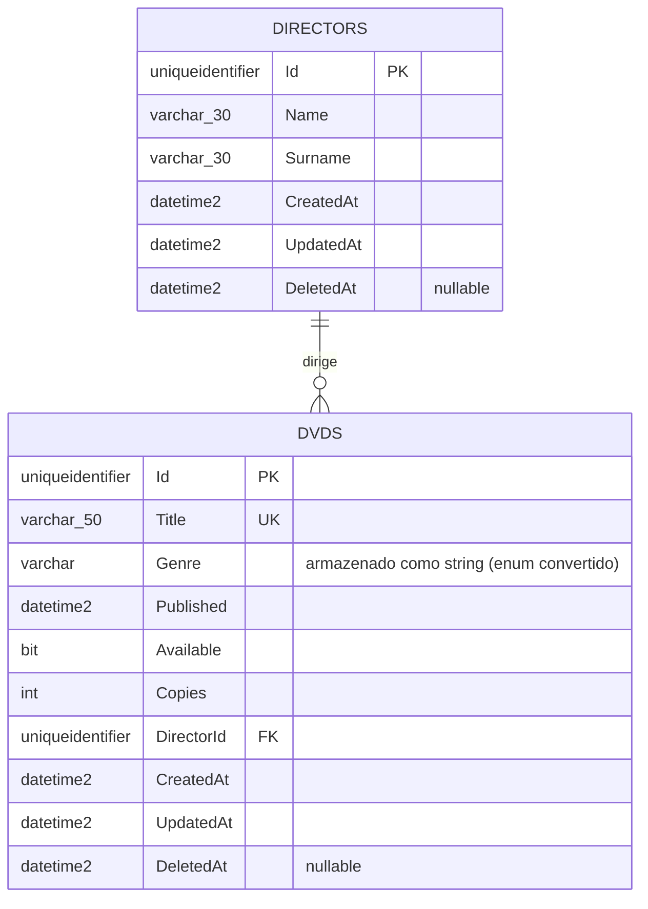
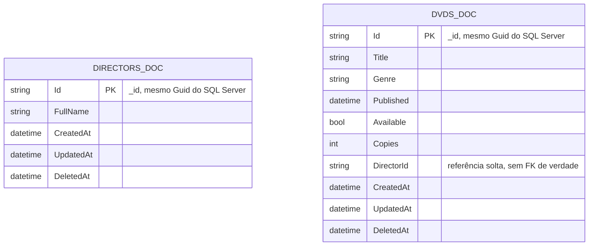

# Diagrama Entidade-Relacionamento (DER)

Este diagrama representa o banco de **escrita** (SQL Server / `CineCloudDb`), mapeado pelo
`CineCloudWriteContext` (Entity Framework Core). É a fonte da verdade do sistema — o lado
de leitura (MongoDB) é uma projeção desnormalizada, sincronizada a partir dos eventos
publicados quando este banco é alterado (veja [../../README.md](../../README.md#arquitetura)).

## Observações

- **`Directors.Id` / `Dvds.Id`**: `Guid` gerado em memória pela entidade base (`Entity`, em
  `BuildingBlocks.Core`), não pelo banco — por isso não há `IDENTITY`/`SEQUENCE`.
- **`Dvds.Title`** tem índice único (`HasIndex(x => x.Title).IsUnique()`), configurado em
  [`DvdConfiguration`](../src/Services/Publisher/Infrastructure/CineCloud.Infrastructure/Config/DvdConfiguration.cs).
- **`Dvds.Genre`** é um enum (`EGenre`) no código, mas persistido como `string` no banco via
  `HasConversion` — facilita leitura direta da tabela sem precisar decodificar números.
- **Exclusão lógica (soft delete)**: nem `Director` nem `Dvd` são removidos fisicamente.
  `DeleteDvd()` marca `Available = false`, zera `Copies` e preenche `DeletedAt`; a exclusão de
  `Director` (`DeleteDirectorCommandHandler`) só é permitida quando ele não tem nenhum `Dvd`
  associado.
- Todas as colunas `string` recebem `varchar(100)` por padrão (configurado globalmente em
  `CineCloudWriteContext.OnModelCreating`), exceto onde uma configuração específica
  (`DirectorConfiguration`/`DvdConfiguration`) define um `HasMaxLength` menor.

## Lado de leitura (MongoDB) — para contexto

O `CineCloud.Queries.Domain` define os documentos do MongoDB (`querydb` / banco
`CineCloudDb`, coleções `Directors` e `Dvds`). Não é um DER porque MongoDB não é relacional —
cada documento já vem desnormalizado, pronto para leitura, sem necessidade de `JOIN`:

`DirectorId` em `DVDS_DOC` é apenas um campo de texto copiado do evento — o MongoDB não aplica
integridade referencial entre coleções, então essa consistência é garantida pelo lado de
escrita (SQL Server), que é quem valida a existência do diretor antes de criar o DVD.
