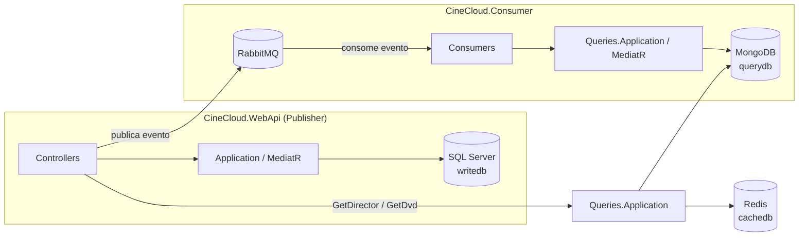

# CineCloud

Sistema de aluguel de filmes (DVDs) construído como projeto de estudo de **CQRS**,
**arquitetura orientada a eventos** e **.NET moderno**. Um serviço de escrita (Publisher)
grava em SQL Server e publica eventos de domínio no RabbitMQ; um serviço consumidor
(Consumer) escuta esses eventos e sincroniza um modelo de leitura desnormalizado no
MongoDB, com um cache Redis na frente das consultas mais acessadas.

> Este README serve como guia de entrada para quem for avaliar, rodar ou contribuir com o
> projeto — cobre desde o que o sistema faz até o passo a passo para subir tudo do zero.

## Sumário

- [Sobre o projeto](#sobre-o-projeto)
- [Arquitetura](#arquitetura)
- [Tecnologias utilizadas](#tecnologias-utilizadas)
- [SDK utilizado](#sdk-utilizado)
- [Pré-requisitos](#pré-requisitos)
- [Passo a passo após clonar o repositório](#passo-a-passo-após-clonar-o-repositório)
- [Banco de dados e infraestrutura (Docker Compose)](#banco-de-dados-e-infraestrutura-docker-compose)
- [Subindo cada container manualmente (`docker run`)](#subindo-cada-container-manualmente-docker-run)
- [Entity Framework Core — migrations](#entity-framework-core--migrations)
- [Testes automatizados](#testes-automatizados)
- [RabbitMQ — painel de gerenciamento](#rabbitmq--painel-de-gerenciamento)
- [Endpoints principais](#endpoints-principais)
- [Documentação adicional](#documentação-adicional)

## Sobre o projeto

O `CineCloud` modela um sistema de locadora: **Diretores** e **DVDs**, com operações de
criar, atualizar, excluir, alugar e devolver um DVD. O que torna o projeto interessante não
é o domínio (propositalmente simples), e sim a arquitetura em volta dele:

- **CQRS** — o lado que escreve (`CineCloud.Application`, sobre SQL Server) é fisicamente
  separado do lado que lê (`CineCloud.Queries.Application`, sobre MongoDB).
- **Orientado a eventos** — toda escrita bem-sucedida na API publica um evento
  (`DirectorCreatedEvent`, `DvdRentedEvent`, etc.) no RabbitMQ via MassTransit. Um serviço
  separado (`CineCloud.Consumer`) escuta esses eventos e replica o dado no MongoDB.
- **Cache** — a consulta de DVD por título (`GET /GetDvd/{title}`) primeiro olha o Redis
  antes de ir ao MongoDB.

## Arquitetura



1. Um `POST`/`PUT`/`DELETE` na API grava no SQL Server e, se a operação for bem-sucedida,
   publica um evento no RabbitMQ (via `IPublishEndpoint`).
2. O `CineCloud.Consumer` está inscrito nessas filas (uma por evento — ver
   [RabbitMQ](#rabbitmq--painel-de-gerenciamento)) e, ao receber um evento, executa o
   command correspondente do lado de leitura, gravando/atualizando o documento no MongoDB.
3. Uma consulta (`GET`) primeiro olha o Redis; se não encontrar, busca no MongoDB e grava o
   resultado no cache antes de responder.

Veja o [Diagrama Entidade-Relacionamento](CineCloud/documentos/DER.md) do banco de escrita para
detalhes de schema.

## Tecnologias utilizadas

| Categoria | Tecnologia |
|---|---|
| Runtime / linguagem | .NET 10, C# (recursos do compilador padrão para `net10.0`) |
| Web API | ASP.NET Core Web API, versionamento via `Asp.Versioning` |
| CQRS / Mediator | MediatR |
| Validação | FluentValidation |
| ORM (escrita) | Entity Framework Core 10 + SQL Server |
| Persistência (leitura) | MongoDB.Driver |
| Cache | StackExchange.Redis (`IDistributedCache`) |
| Mensageria | MassTransit 8 + RabbitMQ |
| Health checks | `AspNetCore.HealthChecks.SqlServer` / `.MongoDb` / `.Redis` / `.UI.Client` |
| Documentação de API | Swashbuckle (Swagger / OpenAPI) |
| Testes | xUnit, FluentAssertions, Moq, coverlet |
| Containers | Docker, Docker Compose |

## SDK utilizado

O projeto inteiro (todos os `.csproj`, `src/` e `test/`) usa:

```
TargetFramework: net10.0
```

Ou seja, é necessário o **.NET 10 SDK** instalado (não roda em SDKs mais antigos, como .NET 8
ou 9 — os projetos exigem `net10.0` explicitamente). Para conferir sua versão instalada:

```bash
dotnet --version
```

Se não tiver o SDK, baixe em <https://dotnet.microsoft.com/download/dotnet/10.0>.

## Pré-requisitos

Antes de clonar e rodar o projeto, tenha instalado:

| Ferramenta | Por quê | Como verificar |
|---|---|---|
| **.NET 10 SDK** | Compilar e rodar os projetos | `dotnet --version` |
| **Docker Desktop** (com Docker Compose v2) | Subir SQL Server, MongoDB, Redis e RabbitMQ | `docker --version` e `docker compose version` |
| **ferramenta `dotnet-ef`** | Criar/aplicar migrations do Entity Framework | `dotnet ef --version` |
| **Git** | Clonar o repositório | `git --version` |
| Um editor/IDE | Visual Studio 2022 (17.14+), VS Code ou Rider — qualquer um com suporte a .NET 10 | — |

Se a ferramenta `dotnet-ef` não estiver instalada:

```bash
dotnet tool install --global dotnet-ef
```

## Passo a passo após clonar o repositório

```bash
# 1. Clonar o repositório
git clone https://github.com/mpalmeidagit/cine-cloud.git
cd cine-cloud/CineCloud

# 2. Criar o arquivo de variáveis de ambiente (a senha do SQL Server não fica no git)
cp .env.example .env
# abra o .env e ajuste a senha se quiser uma diferente da de exemplo

# 3. Subir a infraestrutura e as aplicações via Docker Compose
docker compose up -d --build

# 4. Restaurar e compilar a solution (opcional, o Docker já compila dentro dos containers —
#    mas é útil para abrir o projeto na IDE e rodar/depurar localmente)
dotnet restore CineCloud.slnx
dotnet build CineCloud.slnx

# 5. Rodar a suíte de testes
dotnet test CineCloud.slnx
```

Depois do `docker compose up`, a API estará em `http://localhost:8000/swagger` (aguarde
alguns segundos na primeira subida — o SQL Server demora um pouco para aceitar conexões, e
a própria API já roda a migration automaticamente ao iniciar em ambiente `Docker`).

## Banco de dados e infraestrutura (Docker Compose)

O jeito recomendado de rodar tudo é via Docker Compose — ele sobe SQL Server, MongoDB,
Redis, RabbitMQ, a API e o Consumer já conectados na mesma rede (`cine-cloud-network`),
com as variáveis de ambiente e connection strings corretas.

Os arquivos relevantes (na raiz de `CineCloud/`):

- `docker-compose.yml` — definição das imagens/build de cada serviço.
- `docker-compose.override.yml` — portas expostas, variáveis de ambiente e políticas de
  restart para desenvolvimento local (aplicado automaticamente junto do `docker-compose.yml`).
- `.env` (não versionado — copie de `.env.example`) — guarda o `SA_PASSWORD` do SQL Server.

| Comando | O que faz |
|---|---|
| `docker compose up -d --build` | Builda as imagens da API/Consumer (se necessário) e sobe todos os containers em segundo plano |
| `docker compose up -d` | Sobe os containers sem reconstruir as imagens (mais rápido quando o código não mudou) |
| `docker compose ps` | Lista os containers e o status de cada um (`Up`, `Exited`, etc.) |
| `docker compose logs -f cinecloud.webapi` | Acompanha os logs da API em tempo real (troque o nome do serviço para ver outro) |
| `docker compose down` | Para e remove os containers (mantém as imagens já buildadas) |
| `docker compose build cinecloud.webapi` | Reconstrói só a imagem da API, sem subir nada |
| `docker compose restart cinecloud.webapi` | Reinicia só o container da API (útil após o SQL Server ficar pronto, se a API tiver subido antes dele) |

Portas expostas no host depois do `up`:

| Serviço | Container | Porta no host | Observação |
|---|---|---|---|
| API (Publisher) | `cinecloud.webapi` | `8000` | Swagger em `/swagger`, health check em `/health` |
| Consumer | `cinecloud.consumer` | `8001` | Não expõe endpoints HTTP de negócio, só infraestrutura |
| SQL Server | `writedb` | `1437` → `1433` | Porta 1437 no host para não colidir com outro SQL Server local usando 1433 |
| MongoDB | `querydb` | `27017` | Sem autenticação (uso local/estudo) |
| Redis | `cachedb` | `6379` | Sem autenticação |
| RabbitMQ (AMQP) | `rabbitmq` | `5672` | Usado pela aplicação |
| RabbitMQ (painel web) | `rabbitmq` | `15672` | Acesse em `http://localhost:15672` |

> ⚠️ Como `writedb`/`querydb`/`cachedb` não têm volume persistente configurado ainda, os
> dados se perdem se o container for recriado ou o processo interno reiniciar. A API roda a
> migration do EF automaticamente ao subir em ambiente `Docker`, então o schema do SQL
> Server é recriado sozinho — mas os *dados* gravados anteriormente não voltam.

## Subindo cada container manualmente (`docker run`)

Sim — os comandos abaixo criam e sobem cada container manualmente, um por vez, **sem**
usar o `docker-compose.yml`. São úteis para entender o que o Compose está fazendo por baixo
dos panos, ou para testar um serviço isolado, mas **para o dia a dia use o Docker Compose**
acima — ele já resolve a rede entre os containers (nomes como `writedb`/`rabbitmq` só
funcionam entre containers na mesma rede do Compose) e injeta as variáveis certas.

### 1. SQL Server

```bash
docker run --name sqlserver \
  -e "ACCEPT_EULA=Y" \
  -e "MSSQL_SA_PASSWORD=1q2w3e4r@#$" \
  -p 1437:1433 \
  -d mcr.microsoft.com/mssql/server:2022-latest
```

- `--name sqlserver`: nome do container (você usa esse nome em outros comandos `docker`,
  como `docker logs sqlserver`).
- `-e "ACCEPT_EULA=Y"`: obrigatório — a imagem se recusa a iniciar sem aceitar a licença.
- `-e "MSSQL_SA_PASSWORD=..."`: senha do usuário administrador `sa`. Precisa ter maiúscula,
  minúscula, número e símbolo, com pelo menos 8 caracteres, senão o container falha ao subir.
- `-p 1437:1433`: mapeia a porta 1433 do container (padrão do SQL Server) para a 1437 no seu
  host — assim como fizemos no Compose, para não colidir com outro SQL Server local.
- `-d`: modo *detached* (roda em segundo plano).
- `mcr.microsoft.com/mssql/server:2022-latest`: imagem oficial da Microsoft.

### 2. MongoDB

O comando original tinha dois problemas: o nome da imagem estava errado (`mango` não
existe — é `mongo`) e a variável `AUTH=no` não é reconhecida pela imagem oficial (por
padrão ela já sobe **sem** autenticação, então nem precisa dessa variável). Versão
corrigida:

```bash
docker run --name mongo -d -p 27017:27017 mongo
```

- `--name mongo`: nome do container.
- `-p 27017:27017`: porta padrão do MongoDB.
- `mongo`: imagem oficial (sem tag = pega a `latest`).

### 3. RabbitMQ

```bash
docker run --name rabbit -d -p 5672:5672 -p 15672:15672 rabbitmq:3-management
```

- `-p 5672:5672`: porta do protocolo AMQP (é essa que a aplicação usa para publicar/consumir
  mensagens).
- `-p 15672:15672`: porta do **painel de gerenciamento web** (veja a seção
  [RabbitMQ](#rabbitmq--painel-de-gerenciamento) abaixo).
- `rabbitmq:3-management`: variante da imagem que já vem com o plugin de gerenciamento
  habilitado (a imagem `rabbitmq:3` sozinha não tem o painel web).

### 4. Redis

O comando original estava faltando o valor do `--name` (como estava escrito, o Docker
tentaria usar `-p` como nome do container e falharia). Versão corrigida:

```bash
docker run --name redis -d -p 6379:6379 redis
```

- `--name redis`: nome do container.
- `-p 6379:6379`: porta padrão do Redis.
- `redis`: imagem oficial.

> Depois de subir os 4 containers manualmente, você precisaria ajustar o
> `appsettings.Development.json` da API para apontar para `localhost` em vez dos nomes de
> serviço do Compose (`writedb`, `querydb`, `cachedb`, `rabbitmq`), já que containers soltos
> (sem rede compartilhada) só se enxergam via `localhost` do host.

## Entity Framework Core — migrations

O `DbContext` de escrita é o `CineCloudWriteContext`, definido em
`CineCloud.Infrastructure`. Todos os comandos abaixo assumem que você está na raiz do
projeto (`CineCloud/`, onde fica o `CineCloud.slnx`).

### Via CLI (`dotnet ef`) — funciona em qualquer terminal/SO

```bash
# Criar uma nova migration
dotnet ef migrations add NomeDaMigration \
  --project src/Services/Publisher/Infrastructure/CineCloud.Infrastructure/CineCloud.Infrastructure.csproj \
  --startup-project src/Services/Publisher/Presentation/CineCloud.WebApi/CineCloud.WebApi.csproj \
  --output-dir Migrations

# Aplicar as migrations pendentes no banco (cria/atualiza as tabelas)
dotnet ef database update \
  --project src/Services/Publisher/Infrastructure/CineCloud.Infrastructure/CineCloud.Infrastructure.csproj \
  --startup-project src/Services/Publisher/Presentation/CineCloud.WebApi/CineCloud.WebApi.csproj

# Remover a última migration criada (só funciona se ela ainda não foi aplicada ao banco)
dotnet ef migrations remove \
  --project src/Services/Publisher/Infrastructure/CineCloud.Infrastructure/CineCloud.Infrastructure.csproj \
  --startup-project src/Services/Publisher/Presentation/CineCloud.WebApi/CineCloud.WebApi.csproj

# Listar todas as migrations existentes
dotnet ef migrations list \
  --project src/Services/Publisher/Infrastructure/CineCloud.Infrastructure/CineCloud.Infrastructure.csproj \
  --startup-project src/Services/Publisher/Presentation/CineCloud.WebApi/CineCloud.WebApi.csproj

# Gerar o SQL de uma migration (sem aplicar) — útil para revisar antes de rodar em produção
dotnet ef migrations script \
  --project src/Services/Publisher/Infrastructure/CineCloud.Infrastructure/CineCloud.Infrastructure.csproj \
  --startup-project src/Services/Publisher/Presentation/CineCloud.WebApi/CineCloud.WebApi.csproj
```

Por que sempre passar `--project` e `--startup-project`? O `DbContext` mora no projeto
`CineCloud.Infrastructure` (`--project`), mas quem tem a configuração (connection string,
`appsettings.json`, injeção de dependência) é o `CineCloud.WebApi` (`--startup-project`). Sem
isso, o `dotnet ef` não sabe onde encontrar a string de conexão nem como montar o
`CineCloudWriteContext`.

### Via Package Manager Console (Visual Studio)

Se estiver usando o Visual Studio, primeiro selecione **CineCloud.Infrastructure** como
"Default project" no combo do Package Manager Console (e confirme que o **CineCloud.WebApi**
é o "Startup Project" da solution) — depois é só usar `-Context` em vez das flags de projeto:

```powershell
Add-Migration NomeDaMigration -Context CineCloudWriteContext
Update-Database -Context CineCloudWriteContext
Remove-Migration -Context CineCloudWriteContext
Script-Migration -Context CineCloudWriteContext
```

> **Cuidado com migrations vazias**: se você rodar `Add-Migration`/`dotnet ef migrations add`
> sem ter mudado nada nas entidades (`Director`/`Dvd`) desde a última migration, o EF gera uma
> migration com `Up`/`Down` vazios — não quebra nada, mas é lixo. Se isso acontecer, rode
> `Remove-Migration`/`dotnet ef migrations remove` antes de aplicar.

Hoje o projeto tem uma única migration: `InitialCreate` (cria as tabelas `Directors` e
`Dvds`). Veja o schema completo no [DER](CineCloud/documentos/DER.md).

## Testes automatizados

O projeto tem **296 testes** automatizados (xUnit), organizados em 7 projetos dentro de
`test/`, espelhando a estrutura de `src/`:

| Projeto de teste | O que cobre | Qtd. de testes |
|---|---|---|
| `BuildingBlocks.Core.Tests` | `Entity`, `DomainException` | 12 |
| `CineCloud.Domain.Tests` | Entidades `Director` e `Dvd` (regras de domínio) | 46 |
| `CineCloud.Application.Tests` | Commands/Handlers/Validators do lado de escrita | 79 |
| `CineCloud.Infrastructure.Tests` | Registro de DI (`AddWriteInfrastructure`) | 3 |
| `CineCloud.Queries.Application.Tests` | Commands/Handlers/Validators/Queries do lado de leitura | 95 |
| `CineCloud.WebApi.Tests` | Controllers, cache, exception handler, DI | 40 |
| `CineCloud.Consumer.Tests` | Consumers de eventos MassTransit, DI | 21 |

Bibliotecas usadas: **xUnit** (framework de teste), **FluentAssertions** (asserções
legíveis, `resultado.Should().Be(...)`), **Moq** (mocks de interfaces como repositórios e
`IMediatorHandler`) e **coverlet.collector** (coleta de cobertura de código).

### Comandos

```bash
# Rodar toda a suíte de testes da solution
dotnet test CineCloud.slnx

# Rodar só um projeto de teste específico
dotnet test test/Services/Publisher/Domain/CineCloud.Domain.Tests/CineCloud.Domain.Tests.csproj

# Rodar só os testes cujo nome bate com um filtro
dotnet test CineCloud.slnx --filter "FullyQualifiedName~DirectorTests"

# Rodar com saída detalhada (ver nome de cada teste passando/falhando)
dotnet test CineCloud.slnx --logger "console;verbosity=detailed"

# Rodar coletando cobertura de código (gera um arquivo .cobertura.xml por projeto)
dotnet test CineCloud.slnx --collect:"XPlat Code Coverage"
```

## RabbitMQ — painel de gerenciamento

Depois de subir o Compose, acesse `http://localhost:15672` (usuário/senha padrão da imagem:
**`guest` / `guest`** — não foram sobrescritos no `docker-compose.override.yml`). O painel
tem várias abas; aqui está o que cada uma mostra **e como o CineCloud usa isso**:

- **Overview** — visão geral do broker: taxa de mensagens publicadas/entregues por segundo,
  uso de memória/disco, número de conexões, canais, exchanges, filas e nós do cluster. É a
  primeira aba a olhar para saber "está tudo saudável?".
- **Connections** — cada conexão TCP ativa ao broker. Neste projeto, cada instância do bus do
  MassTransit (uma na API, outra no Consumer) abre sua própria conexão — então, com os dois
  serviços rodando, você verá pelo menos 2 conexões aqui.
- **Channels** — cada *canal* é uma "sub-conexão" leve dentro de uma conexão AMQP (evita abrir
  uma conexão TCP nova para cada publish/consume). O MassTransit gerencia isso internamente;
  aqui dá para ver quantos canais cada conexão está usando e se algum está com mensagens
  "unacked" (recebidas mas ainda não confirmadas).
- **Exchanges** — o RabbitMQ nunca entrega uma mensagem direto numa fila: ela sempre passa
  primeiro por um *exchange*, que decide para quais filas rotear. O MassTransit cria
  automaticamente um exchange do tipo `fanout` com o nome completo do tipo do evento (ex:
  `BuildingBlocks.Core.EventBus.Events:DirectorCreatedEvent`) para cada evento publicado.
- **Queues and Streams** — as filas de fato, onde as mensagens ficam até serem consumidas.
  Este projeto declara uma fila por consumer, com nomes fixos em
  `BuildingBlocks.Core.EventBus.EventBusConstants`:
  `create-director-queue`, `update-director-queue`, `delete-director-queue`,
  `create-dvd-queue`, `update-dvd-queue`, `delete-dvd-queue`, `rent-dvd-queue`,
  `return-dvd-queue`. Clicar numa fila mostra quantas mensagens estão paradas nela (útil para
  perceber se o `CineCloud.Consumer` parou de consumir) e permite inspecionar/republicar
  mensagens manualmente — bom para depurar sem precisar chamar a API de novo.

## Endpoints principais

Documentação interativa completa em `http://localhost:8000/swagger`. Resumo:

| Método | Rota | Descrição |
|---|---|---|
| `POST` | `/api/v1/Directors/create-director` | Cria um diretor |
| `PUT` | `/api/v1/Directors/update-director` | Atualiza um diretor |
| `DELETE` | `/api/v1/Directors/delete-director/{id}` | Remove um diretor (sem DVDs associados) |
| `GET` | `/api/v1/Directors/GetDirector/{fullName}` | Busca um diretor pelo nome completo (lado de leitura) |
| `POST` | `/api/v1/Dvds/create-dvd` | Cria um DVD |
| `PUT` | `/api/v1/Dvds/update-dvd` | Atualiza um DVD |
| `PUT` | `/api/v1/Dvds/rent-dvd/{id}` | Aluga uma cópia do DVD |
| `PUT` | `/api/v1/Dvds/return-dvd/{id}` | Devolve uma cópia do DVD |
| `DELETE` | `/api/v1/Dvds/delete-dvd/{id}` | Remove (soft delete) um DVD |
| `GET` | `/api/v1/Dvds/GetDvd/{title}` | Busca um DVD pelo título (com cache Redis) |
| `GET` | `/health` | Health check agregado (SQL Server, MongoDB, Redis, bus MassTransit) |

## Documentação adicional

- [Diagrama Entidade-Relacionamento (DER)](CineCloud/documentos/DER.md) — schema do banco de escrita
  (SQL Server) e a estrutura dos documentos do lado de leitura (MongoDB).
